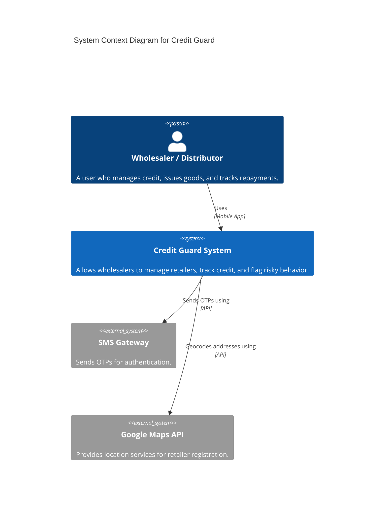
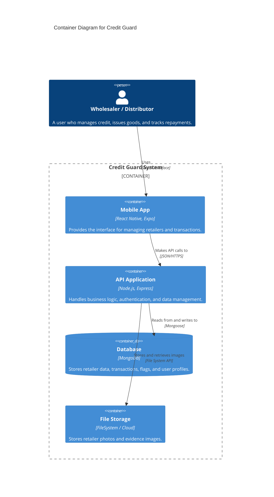
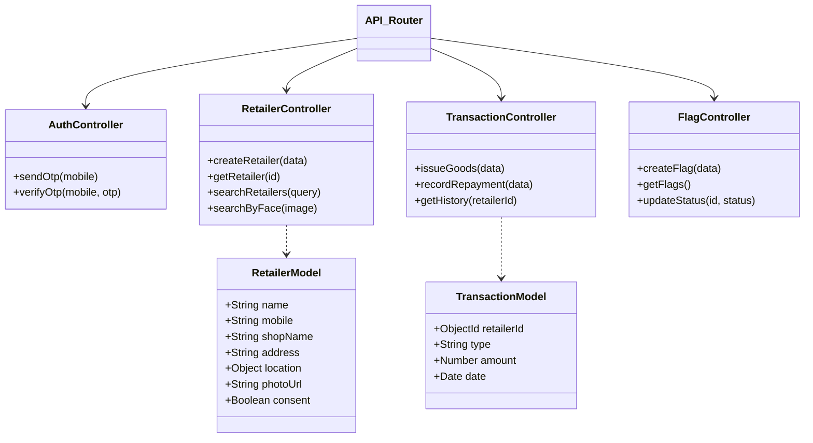

# Credit Guard Architecture

## System Context Diagram

## Container Diagram

## Component Diagram (Backend - Inferred)

## Description

### Mobile Application
The **Credit Guard App** is built using **React Native** with **Expo**. It serves as the primary interface for wholesalers.
*   **Tech Stack**: React Native, Expo Router, NativeWind (Tailwind CSS), Axios.
*   **Key Features**:
    *   **Retailer Management**: Registration with photo and GPS location.
    *   **Transactions**: Issuing goods and recording repayments.
    *   **Risk Management**: Flagging retailers and viewing flags.
    *   **Face Search**: Searching for retailers using facial recognition.

### Backend API (Inferred)
The backend is a **Node.js** application likely using **Express**. It exposes RESTful endpoints consumed by the mobile app.
*   **Authentication**: OTP-based login flow.
*   **Data Handling**: Uses **Mongoose** to interact with MongoDB.
*   **Image Processing**: Handles image uploads for retailer photos and face search.

### Database
**MongoDB** is used as the primary data store.
*   **Collections**: `users`, `retailers`, `transactions`, `flags`.
